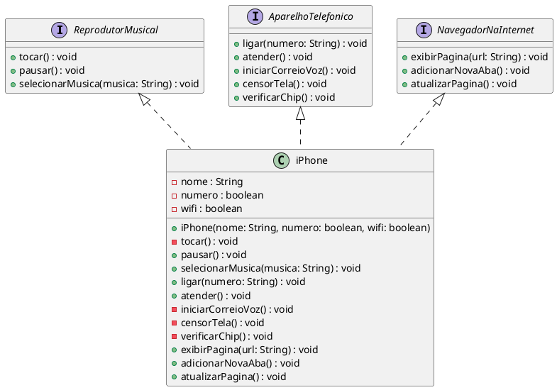

## Desafio Bootcamp-Santander 

Criar um diagrama de classe de acordo com minha interpretação e implementá-lo em Java 

```plantuml
@startuml
interface ReprodutorMusical {
    + tocar() : void
    + pausar() : void
    + selecionarMusica(musica: String) : void
}

interface AparelhoTelefonico {
    + ligar(numero: String) : void
    + atender() : void
    + iniciarCorreioVoz() : void
    + censorTela() : void
    + verificarChip() : void
}

interface NavegadorNaInternet {
    + exibirPagina(url: String) : void
    + adicionarNovaAba() : void
    + atualizarPagina() : void
}

class iPhone implements ReprodutorMusical, AparelhoTelefonico, NavegadorNaInternet {
    - nome : String
    - numero : boolean
    - wifi : boolean
    
    + iPhone(nome: String, numero: boolean, wifi: boolean)
    - tocar() : void
    + pausar() : void
    + selecionarMusica(musica: String) : void
    + ligar(numero: String) : void
    + atender() : void
    - iniciarCorreioVoz() : void
    - censorTela() : void
    - verificarChip() : void
    + exibirPagina(url: String) : void
    + adicionarNovaAba() : void
    + atualizarPagina() : void
}
@enduml
```
Diagrama UMl

